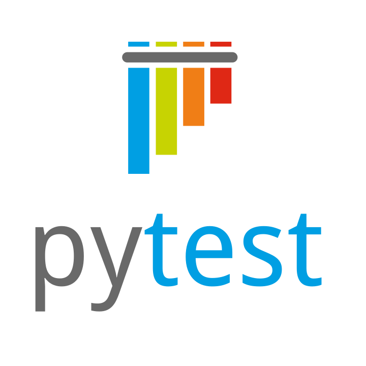
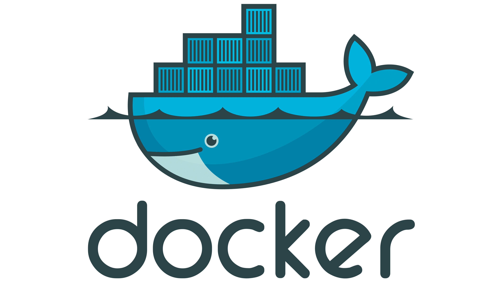

##  Привет! Я Светлана Хадосевич👋

#### Middle QA Engineer | Manual Testing → Test Automation

- 💻 3 года в тестировании
- 🐍 Пишу автотесты на Python
- ⚙️ Развиваюсь в автоматизации
- 📫 Связаться со мной: [Telegram](https://t.me/khadosevich) | [Email](mailto:svetochka1502@gmail.com)

#### Мой стек:
| Python | PyCharm | Git | Pytest | Requests | Playwright | Allure Report | Docker | Gitlab CI |
|--------|---------|-----|--------|----------|----------|---------------|--------|-----------|
|   |   || |  | | | | |

#### Мои проекты:
| API My Shows Rating          | API Битва покемонов               | UI Битва покемонов |
|------------------------------|-----------------------------------|--------------------|
| [my-shows-api-tests](https://github.com/svetlana-khadosevich/myshows_api_tests) | [pokemonbattle-api-tests](https://github.com/svetlana-khadosevich/pokemonbattle_api_tests) | [pokemonbattle-e2e-tests](https://github.com/svetlana-khadosevich/pokemonbattle_e2e_tests_playwright)   
| Pytest, Requests, Docker     | Pytest, Requests, Gitlab CI       | Selenium, Gitlab CI|
